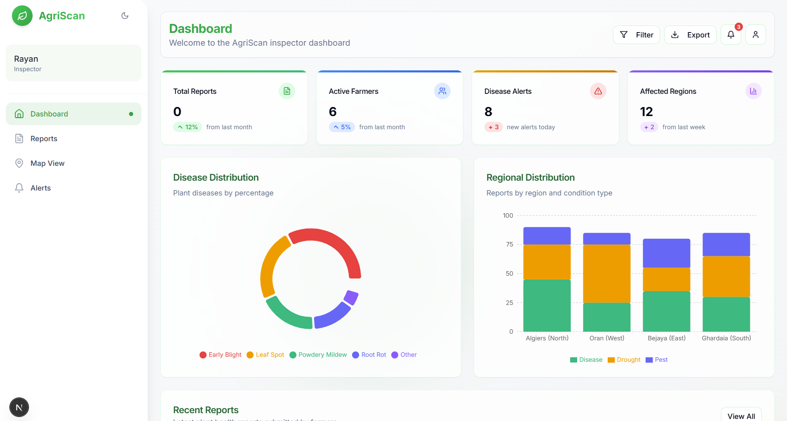
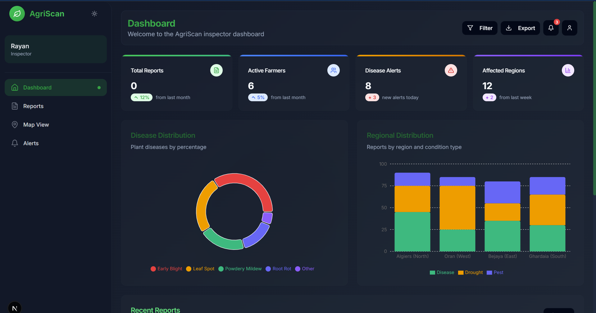
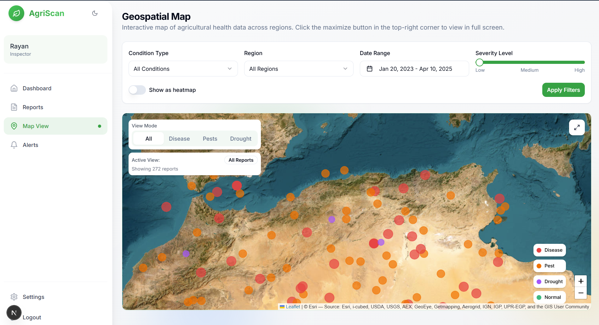
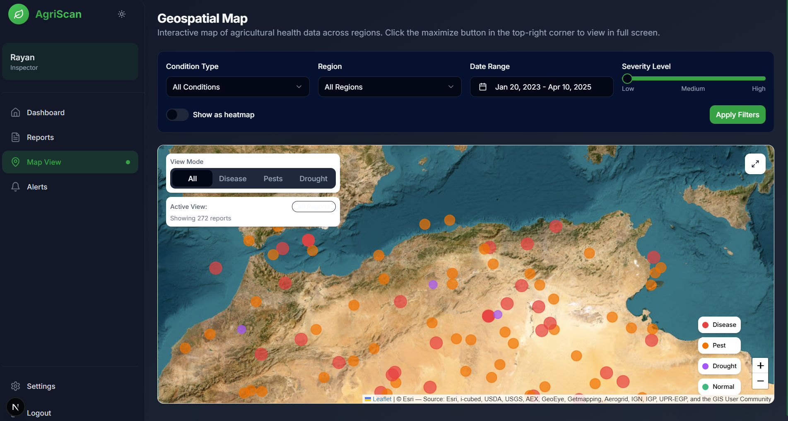
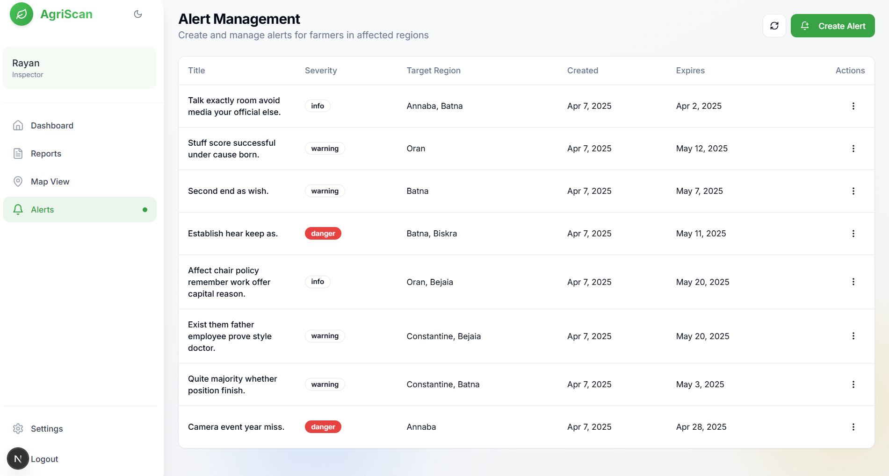
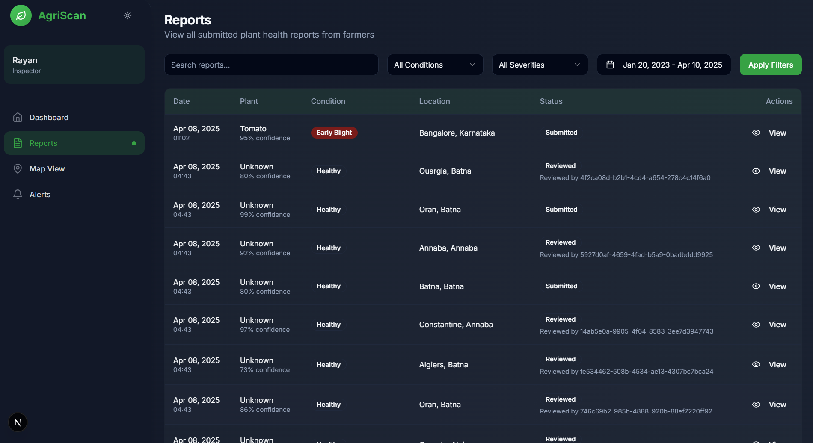

# AgriScan - Agricultural Monitoring Dashboard

AgriScan is a web application designed to help agricultural inspectors monitor crop health, track disease outbreaks, manage alerts, and visualize data geographically.

## Screenshots

**Dashboard (Light/Dark Mode)**



**Geospatial Map View (Light/Dark Mode)**



**Alert Management**


**Reports View**


*(Note: Ensure the images are placed in the `public/readme-images/` directory with the corresponding filenames for them to display correctly.)*

## Features

*   **Dashboard Overview:** Displays key metrics like total reports, active farmers, disease alerts, and affected regions. Includes charts for disease distribution and regional distribution.
*   **Reports Management:** View, search, and filter submitted plant health reports from farmers.
*   **Geospatial Map View:** Interactive map displaying agricultural health data across regions with filtering options for condition type, region, date range, and severity. Supports heatmap visualization.
*   **Alert Management:** Create and manage alerts for farmers in affected regions based on severity and target regions.
*   **User Authentication:** Secure login and signup functionality.
*   **Responsive Design:** Adapts to different screen sizes.
*   **Light/Dark Mode:** Theme switching for user preference.

## Tech Stack

*   **Framework:** [Next.js](https://nextjs.org/) (v15+)
*   **Language:** [TypeScript](https://www.typescriptlang.org/) (v5+)
*   **UI Library:** [React](https://reactjs.org/) (v19+)
*   **Styling:** [Tailwind CSS](https://tailwindcss.com/) (v3+)
*   **UI Components:** [Shadcn UI](https://ui.shadcn.com/) (using Radix UI primitives and Lucide icons)
*   **Forms:** [React Hook Form](https://react-hook-form.com/), [Zod](https://zod.dev/)
*   **Charts:** [Recharts](https://recharts.org/)
*   **Maps:** [Leaflet](https://leafletjs.com/), [React-Leaflet](https://react-leaflet.js.org/)
*   **State Management:** React Context API (implied by `contexts/` folder)
*   **Data Fetching:** Custom hooks (`hooks/`), [Axios](https://axios-http.com/)
*   **Date Handling:** [date-fns](https://date-fns.org/), [React Day Picker](https://react-day-picker.js.org/)
*   **Theming:** [next-themes](https://github.com/pacocoursey/next-themes)
*   **Notifications:** [Sonner](https://sonner.emilkowal.ski/)

## Getting Started

1.  **Clone the repository:**
    ```bash
    git clone <your-repository-url>
    cd Frontend # Or your project directory name
    ```
2.  **Install dependencies:**
    ```bash
    npm install
    ```
    *or*
    ```bash
    yarn install
    ```
3.  **Run the development server:**
    ```bash
    npm run dev
    ```
    *or*
    ```bash
    yarn dev
    ```
4.  Open [http://localhost:3000](http://localhost:3000) with your browser to see the result.

## Folder Structure

```
.
├── app/                  # Next.js App Router: Pages, Layouts, API Routes
│   ├── dashboard/        # Dashboard specific pages and layout
│   ├── login/            # Login page
│   ├── signup/           # Signup page
│   ├── layout.tsx        # Root layout
│   └── page.tsx          # Home page
├── components/           # Reusable UI components
│   ├── auth/             # Authentication related components
│   ├── dashboard/        # Dashboard specific components
│   └── ui/               # Base UI components (Shadcn UI)
├── contexts/             # React Context providers (e.g., AuthContext)
├── data/                 # Static data (e.g., location lists)
├── hooks/                # Custom React hooks for data fetching and logic
├── lib/                  # Utility functions, API helpers
├── public/               # Static assets (images, fonts)
│   └── readme-images/    # Screenshots for README
├── styles/               # Global styles, CSS files
├── types/                # TypeScript type definitions
├── .gitignore            # Git ignore file
├── next.config.mjs       # Next.js configuration
├── package.json          # Project dependencies and scripts
├── tailwind.config.ts    # Tailwind CSS configuration
└── tsconfig.json         # TypeScript configuration
